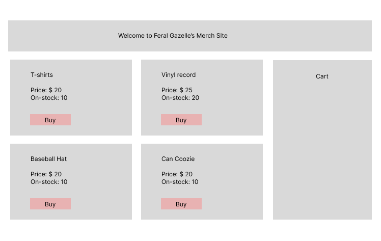

# Merch Site

### Created by Noah Lundquist and Harold Mesa in November of 2022

## Links

* [Repository](https://github.com/nalundquist/merch-site)

## Description

A React-based website selling merch for Feral Gazelle, famed indie-noise-crust-folk duo.  Built as an experiment in utilizing a redux reducer to handle state changes.  Only has Create functionality at this point but RUD could be easily built out from this point.

## Features

* Post objects to later be sold
* Not copyright infringing
* Utilizes Redux for scalability

## Technologies Used

* Built in VS Code (v.1.70.1) using the following languages:
	* Javascript
	* React
	* CSS
	* JSX
	* HTML

Tested in Latest Google Chrome build

## Installation

* Download [Git Bash](https://git-scm.com/downloads)
* Input the following into Git Bash to clone this repository onto your computer:

		>git clone https://github.com/nalundquist/merch-site

* Enter the cloned project folder "merch-site" and type:

		>npm install

* After such you can type:

		>npm run start

* To host the site on your machine at localhost:3000.

## Known Bugs

None at this point

## License

Licensed under [GNU GPL 3.0](https://www.gnu.org/licenses/gpl-3.0.en.html)